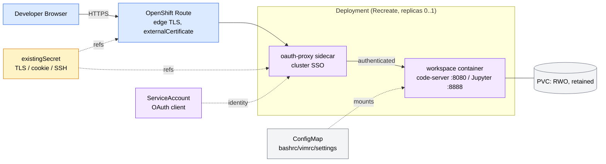

# dev-workspaces

An OpenShift-native Helm chart that provisions an isolated, browser-accessible
development environment (code-server + Jupyter Lab) **per developer**, backed by
persistent storage and fronted by cluster single sign-on.

**One Helm release == one developer.** Resources are name-prefixed
`dev-workspace-<user>` and live in a shared namespace, so 10–50 developers run as
independent, name-prefixed releases side by side.

> The chart is the MVP. The workspace container **image is a placeholder**
> ([`../../image`](../../image)); pods report `ImagePullBackOff` until a real
> image is published — expected per spec.

## Architecture



The request path: **Browser → Route (edge TLS, terminates at the router) → Service
→ oauth-proxy sidecar (plain HTTP :4180; redirects unauthenticated users to the
OpenShift login) → code-server / Jupyter.**

## Prerequisites

| # | Prerequisite | Notes |
|---|---|---|
| 1 | **OpenShift 4.x** | `Route`, OAuth, SCC. `route.tls.externalCertificate` is **GA on OCP 4.19+** (Tech-Preview / feature-gated on 4.16–4.18). |
| 2 | **RWO StorageClass** | Set `persistence.storageClassName` explicitly if the cluster has no default. |
| 3 | **Pre-created Secrets** | TLS cert, oauth cookie, (optional) SSH keys — see below. The chart references them by name only; it never templates secret values. |
| 4 | **Router can read the cert Secret** | The chart renders a scoped secret-reader Role/RoleBinding when `route.tls.createRouterRbac=true` (default). |
| 5 | **SCC for the fixed UID** | `runAsUser: 1001` is rejected by `restricted-v2`. Use `scc.create=true` (cluster-admin) or grant `anyuid`/a custom SCC out of band. |
| 6 | **Registry pull access** | `registry.redhat.io/openshift4/ose-oauth-proxy` (and `ose-cli` for the reaper) need the cluster pull secret or `imagePullSecrets`. |

### Pre-create the Secrets

```bash
NS=dev-workspaces
# TLS cert/key for the Route hostname (SAN must cover route.host)
oc create secret tls alice-workspace-tls -n $NS --cert=alice.crt --key=alice.key
# oauth-proxy cookie/session secret — MUST be 16, 24, or 32 bytes
oc create secret generic alice-oauth-cookie -n $NS \
    --from-literal=cookie-secret=$(openssl rand -base64 32)
# (optional) SSH authorized_keys
oc create secret generic alice-ssh-authorized-keys -n $NS \
    --from-file=authorized_keys=$HOME/.ssh/id_ed25519.pub
```

## Quick start

```bash
helm install alice charts/dev-workspaces -n dev-workspaces \
  --set user=alice \
  --set route.host=alice-workspace.apps.example.com \
  --set route.tls.externalCertificate.name=alice-workspace-tls \
  --set oauthProxy.cookieSecret.existingSecret=alice-oauth-cookie
```

…or commit a small per-developer values file (the GitOps model) and install with
`-f`:

```bash
helm install alice charts/dev-workspaces -n dev-workspaces -f my-values/alice.yaml
```

See [`../../examples`](../../examples) for ready-to-copy value files
(`values-developer.yaml`, `values-suspended.yaml`, `values-ssh-enabled.yaml`,
`values-scc-custom.yaml`, `values-scc-anyuid.yaml`, `values-idle-reaper.yaml`).

## The per-developer / GitOps model

A per-developer values file overrides **only what differs** from the defaults —
typically just the user, the hostname, and the Secret names:

```yaml
user: alice
route:
  host: alice-workspace.apps.example.com
  tls:
    externalCertificate:
      name: alice-workspace-tls
oauthProxy:
  cookieSecret:
    existingSecret: alice-oauth-cookie
```

`user` (and the release name) form the **immutable** Deployment/Service selector,
so keep them fixed for the life of a release. `values.schema.json` validates input
on every `install`/`upgrade`/`lint`/`template` and **fails fast** on a missing or
malformed `user` (and rejects typo'd top-level keys).

## Suspend / resume

A single `suspended` value toggles the Deployment between 1 replica (running) and
0 (suspended). Because the strategy is `Recreate`, resume never hits a Multi-Attach
error on the RWO volume.

```bash
# Suspend (0 running pods, zero compute; PVC retained)
helm upgrade alice charts/dev-workspaces -n dev-workspaces --reuse-values --set suspended=true
# Resume (prior $HOME data intact)
helm upgrade alice charts/dev-workspaces -n dev-workspaces --reuse-values --set suspended=false
```

In-memory editor state is lost on suspend (expected); files on the PVC survive.

### Optional idle reaper

`idleReaper.enabled=true` renders a `CronJob` that reads workspace pod CPU from the
metrics API and, after `idleMinutes` of continuous sub-`cpuThresholdMillicores`
activity (tracked via a `dev-workspaces.io/idle-since` Deployment annotation),
scales the workspace to 0. It **no-ops safely when metrics are unavailable**, so it
never suspends an active or unmeasurable workspace. Resume stays explicit (no
auto-wake-on-access).

While the reaper is enabled, the chart **stops managing the replica count** for a
running workspace (it omits `replicas` from the Deployment) so the reaper's live
scale-to-0 is not reverted by the next `helm upgrade` or a GitOps reconcile. Resume
a reaped workspace with `oc scale deployment/dev-workspace-<user> --replicas=1`.
`suspended: true` still forces an explicit scale-to-0 in either mode.

## Security: fixed UID + SCC

The pod runs as a fixed `securityContext.runAsUser` (default `1001`, group `0`,
`fsGroup 1001` — the OpenShift arbitrary-UID pattern). This UID is rejected by the
default `restricted-v2` SCC, so admit it one of these ways:

- `scc.create=true, scc.use=custom` — renders a least-privilege SCC pinned to the
  UID + a `use` Role/RoleBinding bound to the workspace ServiceAccount.
- `scc.create=true, scc.use=anyuid` — renders **only** a RoleBinding to the
  built-in `system:openshift:scc:anyuid` ClusterRole (no SCC object).
- Grant a suitable SCC to the ServiceAccount out of band.

All three require **cluster-admin**, which is why `scc.create` defaults to `false`.

## Optional SSH

`ssh.enabled=true` renders an SSH `Service` and wires `ssh.existingSecret`
(`authorized_keys`) into the pod. Dependent on the future image shipping an `sshd`;
nothing SSH-related renders when disabled.

## Uninstall & PVC retention

```bash
helm uninstall alice -n dev-workspaces
```

With `persistence.retain=true` (default), the PVC carries
`helm.sh/resource-policy: keep` and **survives uninstall** (and `upgrade` pruning).
To reattach the data later, reinstall with the **same release name** — Helm adopts
the retained PVC (it keeps its `meta.helm.sh/release-*` metadata) and the workspace
comes back with `$HOME` intact. A clean teardown requires deleting the PVC manually.

> On reinstall, keep `persistence.size`, `storageClassName`, `accessModes`, and
> `volumeName` the **same** as the retained PVC. Those fields are immutable once a
> PVC is bound, so changing them makes Helm's apply to the adopted PVC fail. To
> resize/re-class, provision a new PVC (new `user`/release) or migrate the data.

## Troubleshooting

| Symptom | Cause / fix |
|---|---|
| Pod `ImagePullBackOff` (workspace) | Placeholder image not built yet — expected. Set `image.repository`/`tag` to a real image. |
| Pod rejected, `unable to validate against any security context constraint` | Fixed UID not admitted. Enable an SCC (see Security) or grant one to the SA. |
| oauth-proxy `ImagePullBackOff` | Cluster lacks `registry.redhat.io` pull access; add it or set `imagePullSecrets`. |
| PVC stuck `Pending` | No default StorageClass; set `persistence.storageClassName`. |
| Browser shows the router's default cert, not yours | Router SA can't read the cert Secret. Keep `route.tls.createRouterRbac=true`, or grant it cluster-side. On OCP < 4.19 enable the `RouteExternalCertificate` feature gate. |
| OAuth login loops / `redirect_uri` error | The Route name must equal `dev-workspace-<user>` (it does by default); the SA OAuth redirect-reference points at it automatically. |
| OAuth login fails with a TLS/certificate error *after* the OpenShift login | oauth-proxy can't validate the OAuth server's ingress cert with the SA CA. Mount the cluster/ingress CA and add a second `--openshift-ca` via `oauthProxy.extraArgs` + `extraVolumes`/`extraVolumeMounts`, or use a publicly-trusted ingress cert. |
| `helm install` fails on schema | `user` missing/invalid, a required Secret name unset for an enabled feature, or a typo'd values key. The error names the field. |

## Values reference

Full, commented defaults live in [`values.yaml`](values.yaml); `values.schema.json`
is the enforced contract. Highlights:

| Key | Default | Purpose |
|---|---|---|
| `user` | _(required)_ | Developer id; drives `dev-workspace-<user>` naming. |
| `suspended` | `false` | `true` → 0 replicas. |
| `image.repository` / `.tag` | placeholder | Workspace image (tag defaults to `appVersion`). |
| `persistence.size` / `.storageClassName` / `.retain` | `10Gi` / `""` / `true` | RWO `$HOME` volume; retained on uninstall. |
| `route.host` | `""` | Public hostname (required when `route.enabled`). |
| `route.tls.externalCertificate.name` | `""` | Pre-created `kubernetes.io/tls` Secret (required when `route.enabled`). |
| `oauthProxy.cookieSecret.existingSecret` | `""` | Cookie Secret (required when `oauthProxy.enabled`). |
| `securityContext.runAsUser` | `1001` | Fixed UID (needs an admitting SCC). |
| `scc.create` / `scc.use` | `false` / `custom` | Optional SCC (`custom` or `anyuid`). |
| `idleReaper.enabled` | `false` | Optional CPU-heuristic idle auto-suspend. |
| `ssh.enabled` | `false` | Optional SSH Service + key wiring. |
| `workspace.resources` | `250m`/`512Mi` … `2`/`4Gi` | Per-container request/limit envelope. |

## Compatibility

- **Helm** 3.x or 4.x (validated on 4.2.0). `values.schema.json` is draft-07.
- **OpenShift** 4.x; `route.tls.externalCertificate` requires **4.19+** (or the
  feature gate on 4.16–4.18).
