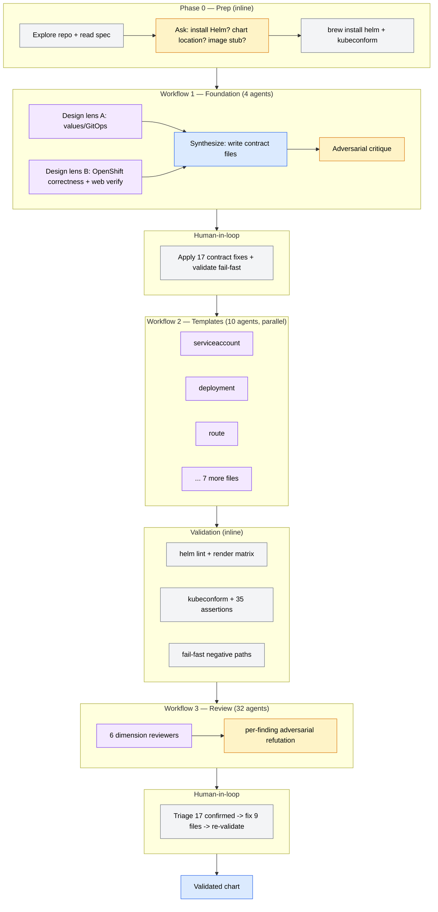

# dev-workspaces — Build Report

**Date**: 2026-06-06
**Author**: Stephen Sequenzia (orchestrated by Claude Code, Opus 4.8)
**Subject**: How the `dev-workspaces` Helm chart was built from `specs/dev-workspaces-SPEC.md` using dynamic multi-agent workflows.

---

## 1. Executive summary

Starting from an essentially empty repository (a PRD, a prompt, a stub README), the
`dev-workspaces` OpenShift Helm chart was built end-to-end using **four dynamic
workflows** orchestrated in sequence, with a human-in-the-loop review between each
phase. The build used a **contract-first** strategy: an authoritative chart contract
(`values.yaml`, `values.schema.json`, `_helpers.tpl`, `Chart.yaml`) was designed,
adversarially critiqued, and validated **before** any resource template was written,
so the 10 template files could be generated in parallel against a fixed, proven
contract without drifting apart.

| Metric | Value |
|---|---|
| Workflows run | 4 (foundation, templates, validation*, review) |
| Subagents spawned | **46** (4 + 10 + 32) |
| Subagent tokens | **~2.16M** |
| Subagent tool calls | **733** |
| Template files generated | 10 (+ `_helpers.tpl`, `NOTES.txt`) |
| Review findings confirmed & fixed | 17 (of 26 raised; 9 refuted) |
| Foundation critique findings applied | 17 |
| Final validation | `helm lint` clean · `kubeconform` 73 valid / 0 invalid · 35+15 correctness assertions · fail-fast verified |

\* The validation phase was executed inline (deterministic shell: `helm`,
`kubeconform`, `jsonschema`) rather than as an agent workflow.

---

## 2. Why this shape — methodology

Two properties of Helm charts drove the approach:

1. **Templates are tightly coupled.** Every template references the same `.Values.*`
   keys and `_helpers.tpl` functions. If you fan out template generation to parallel
   agents *without* a shared, concrete contract, they drift — one writes
   `image.repository`, another `image.repo` — and the chart won't render.
2. **OpenShift has high-leverage footguns.** Edge-TLS Routes with a cert-from-Secret
   (`externalCertificate`), oauth-proxy args behind an edge route, the SA OAuth
   redirect annotation, and SCC `use` grants are all easy to get subtly wrong in
   ways that *render valid YAML but fail at runtime*.

The response to (1) was **contract-first**: materialize the contract as real files on
disk, prove it with `helm lint` + schema fail-fast tests, then let leaf-template
agents *read* those files rather than re-deriving the contract from prose.

The response to (2) was **adversarial, docs-grounded review**: the highest-value use
of multi-agent orchestration here is not generation (the spec is prescriptive) but
*verification* — diverse reviewers checking OpenShift semantics against live
documentation, each finding then independently refuted before being accepted.

---

## 3. Orchestration overview



---

## 4. Phase-by-phase breakdown

### Phase 0 — Environment prep (inline)

- Explored the repo (empty but for `specs/`, `internal/`, stub `README.md`).
- Found `helm` **not installed**, `oc` **aliased to `opencode`** (not the OpenShift
  CLI), `kubectl` present.
- Asked three bounded decisions (per the user's "ask before tool installs /
  architectural choices" standard): install Helm? chart location? image stub? — all
  answered with the recommended option.
- Installed `helm` (v4.2.0) and later `kubeconform` via Homebrew, in the background.

### Workflow 1 — Foundation (4 agents · 223K tokens · 64 tool calls · ~15 min)

**Script structure**: `parallel()` for two diverse design agents → one synthesizer →
one critic.

| Phase | Agent(s) | Role |
|---|---|---|
| Design | `design:values-gitops` | Cleanest `values.yaml`/schema/helpers for GitOps ergonomics |
| Design | `design:openshift-correctness` | Verified Route `externalCertificate`, oauth-proxy edge args, SA OAuth annotation, SCC against **live OpenShift docs** (WebSearch/WebFetch) |
| Synthesize | `synthesize:foundation` | Reconciled both proposals, **wrote** `Chart.yaml`, `values.yaml`, `values.schema.json`, `_helpers.tpl`, `.helmignore`; returned a structured per-template implementation brief |
| Critique | `critique:foundation` | Adversarial review of the written contract → **17 findings** (3 critical, 5 high, 5 medium, 4 low) |

**Pattern used**: *diverse-lens design panel* (generation from two angles) + *write-the-contract-to-disk* (the contract becomes concrete files, not prose) + *adversarial critique*.

#### Contract fixes applied before fan-out (17)

The critique was triaged into **contract-level** (fixed immediately) vs.
**template-level** (folded into the per-file briefs for Workflow 2):

| Severity | Finding | Resolution (contract-level) |
|---|---|---|
| Critical | Selector labels not stable (mutable `nameOverride`/`component` in selector) | Reduced `selectorLabels` to name + instance + `dev-workspaces.io/user`; moved component/version to metadata labels |
| Critical | Route `externalCertificate` router-RBAC subject under-specified | Added `route.tls.routerServiceAccount` values + schema |
| Critical | OAuth redirect `apiVersion` ("v1"?) | **Deferred to review** — later *confirmed correct* by refutation |
| High | Port collision (proxy/Jupyter/Service all on 8888) | proxy→4180, Service→8443, code-server 8080, Jupyter 8888 |
| High | Schema didn't catch typo'd keys | root `additionalProperties: false` + `global` allowance |
| Medium | User sanitization could alias distinct users | Helper now **rejects** non-DNS users instead of silently rewriting |
| Medium | Schema nits (size `m` suffix, NodePort range) | Tightened regex; NodePort 30000–32767; dropped liveness-unsafe `successThreshold` |
| Low | Suffixed names could exceed 63 for long users | `user` max 40; `trunc 63` after suffixing |

Template-level findings (oauth-proxy edge args, SCC `anyuid` branch, PVC reinstall
adoption, registry pull-secret docs) were written into the Workflow 2 briefs.

Validated the contract before proceeding: `helm lint` clean; schema **fails fast** on
missing `user`, invalid `user`, and a typo'd top-level key.

### Workflow 2 — Templates (10 agents · 417K tokens · 150 tool calls · ~3 min)

**Script structure**: a single `parallel()` of 10 agents, one per file, each given a
**shared conventions block** (helper names, the cross-file port/volume contract,
metadata patterns) plus a file-specific brief, each instructed to *read the contract
files first* and *write only its own file*.

Files generated: `serviceaccount.yaml`, `configmap.yaml`, `pvc.yaml`, `service.yaml`,
`route.yaml`, `deployment.yaml`, `scc.yaml`, `cronjob.yaml`, `ssh-service.yaml`,
`NOTES.txt`.

**Pattern used**: *contract-first parallel fan-out*. Because the contract was fixed
on disk, 10 agents writing 10 distinct files in parallel produced a self-consistent
chart — the shared port/volume names (e.g. the Service port `public` → oauth-proxy
container port → Route `targetPort`) lined up across files without coordination.

### Validation (inline, deterministic)

- `helm lint` clean across example value files.
- Rendered **6 scenarios** (developer, suspended, ssh, scc-custom, scc-anyuid,
  idle-reaper) + **2 edge cases** (oauth/route disabled; persistence/configmap
  disabled).
- `kubeconform` (k8s 1.29 schemas): **34 valid / 0 invalid**, 5 skipped (the
  OpenShift CRDs Route + SCC, which have no upstream schema).
- **35 targeted correctness assertions** across all spec acceptance criteria
  (Recreate strategy, replica toggle, oauth-proxy edge args, edge-TLS + cert-Secret,
  SA OAuth annotation, PVC keep, SCC custom/anyuid branches, reaper, SSH).
- **Fail-fast negative paths**: missing TLS/cookie/SSH secrets each rejected with a
  clear message.
- **Max-length (40-char) user**: every derived resource name ≤ 63 chars.

### Workflow 3 — Review (32 agents · 1.52M tokens · 519 tool calls · ~9 min)

**Script structure**: `pipeline(dimensions, review, verify)` — six dimension
reviewers, and as each review completes its findings are **immediately** fanned out
to independent skeptics (no barrier between review and verify).

| Dimension | Focus |
|---|---|
| `spec-acceptance` | Every US-001…011 acceptance criterion mapped to rendered evidence |
| `oauth-openshift` | oauth-proxy edge handshake, SA redirect `apiVersion`, CA sufficiency (live docs) |
| `route-tls-rbac` | `externalCertificate` field, router RBAC scoping, WebSocket timeout |
| `scc-security` | Custom/anyuid SCC admission correctness, fsGroup, least-privilege |
| `lifecycle-storage-reaper` | Recreate/RWO/suspend, PVC adoption, reaper RBAC + script safety |
| `helm-hygiene` | Selector immutability, checksum, naming/trunc, values↔schema consistency |

**Pattern used**: *perspective-diverse review + per-finding adversarial refutation*.
Each raised finding was handed to an independent agent told to **try to refute it**;
only findings that survived refutation (and weren't downgraded to "not-a-defect")
were accepted. **26 raised → 17 confirmed, 9 dismissed.** The dismissed set included
the OAuth `apiVersion: "v1"` concern — refutation confirmed `v1` is the canonical
Red Hat form, closing that open question.

#### Confirmed findings & fixes (17, across 9 files)

| Sev | # | Finding | Fix |
|---|---|---|---|
| **High** | 1·13·17 | `route`/`oauthProxy` toggles uncoupled → workspace exposed over HTTPS with **zero auth** (and the reverse leaves the OAuth client with no redirect) | Added a `validateSecrets` invariant: `route.enabled == oauthProxy.enabled` (both-on secure, both-off internal); fails fast otherwise |
| **Med** | 5 | Edge-route WebSockets use `timeout tunnel`, not `timeout server` | Added `haproxy.router.openshift.io/timeout-tunnel` annotation |
| **Med** | 9 | Reaper's `oc scale 0` reverted by next `helm upgrade`/GitOps | Omit `replicas` while reaping; resume via `oc scale`; `suspended:true` still forces 0 |
| **Med** | 12 | Reaper bound to the **workspace** SA (privilege coupling) | Dedicated least-privilege reaper ServiceAccount |
| Low | 2 | `ssh.key` ignored (whole-secret mount) | `items` projection → fixed `authorized_keys` filename |
| Low | 7 | Custom SCC lacked `priority` (non-deterministic selection) | Added configurable `scc.priority` (default 10) |
| Low | 8 | SCC admitted any seccomp profile | Added `seccompProfiles: [runtime/default]` allowlist |
| Low | 10 | Corrupt `idle-since` could wedge the reaper under `set -eu` | Numeric self-heal guard |
| Low | 6 | `kubeVersion` floor too low vs. `externalCertificate` | Raised to `>=1.29.0-0` (OCP 4.16, where the field exists) |
| Low | 14 | Empty sidecar image tag → trailing-colon ref | `taggedImage` schema def requires a non-empty tag |
| Low | 15 | `validateSecrets` misattributed errors to `ssh-service.yaml` | Removed; `deployment.yaml` validates centrally |
| Low | 16 | Bare `annotations:`/`volumeMounts:` null keys on empty config | Guarded all three pod-spec keys |
| Low | 3·4·11 | Misleading X-Forwarded-Proto rationale; oauth-proxy CA caveat; PVC immutable-spec reinstall | Documentation corrections (values.yaml, README) |

Removed the now-orphaned `dev-workspaces.replicas` helper (dead code) after inlining
the replica logic.

#### Re-validation after fixes

`helm lint` clean · all scenarios + both-off mode render · `kubeconform` **73 valid /
0 invalid** · **15/15** fix-verification assertions · all three new guards fire
(zero-auth blocked, redirect-less OAuth blocked, empty sidecar tag blocked) · all
example value files still schema-valid.

---

## 5. Workflow patterns used

| Pattern | Where | Why it fit |
|---|---|---|
| Diverse-lens design panel | Foundation design | Two angles (GitOps ergonomics vs. OpenShift correctness) surface more than one generator |
| Write-the-contract-to-disk | Foundation synthesize | Makes the contract concrete files (no prose drift) for downstream agents to read |
| Adversarial critique | Foundation critique | Catch contract defects before they propagate into 10 parallel templates |
| Contract-first parallel fan-out | Templates | Fixed on-disk contract lets 10 agents write 10 files concurrently and stay consistent |
| Pipeline (no barrier) | Review | Each dimension's findings verify the moment that dimension finishes |
| Per-finding adversarial refutation | Review verify | Independent skeptic per finding kills plausible-but-wrong claims (9 of 26 dismissed) |
| Human-in-the-loop between workflows | After W1 and W3 | Triage/apply fixes and re-validate deterministically before the next phase |

---

## 6. Per-workflow metrics

| Workflow | Agents | Subagent tokens | Tool calls | Wall-clock |
|---|---:|---:|---:|---:|
| 1 — Foundation | 4 | 223,491 | 64 | ~15.1 min |
| 2 — Templates | 10 | 417,166 | 150 | ~3.0 min |
| 3 — Review | 32 | 1,515,054 | 519 | ~8.8 min |
| **Total** | **46** | **2,155,711** | **733** | **~26.9 min** |

(Validation and fix application ran inline between/after workflows and are not counted
above. Wall-clock overlaps with inline work done while workflows ran in the
background.)

---

## 7. Deliverables produced

```
charts/dev-workspaces/
  Chart.yaml · values.yaml · values.schema.json · .helmignore · README.md
  templates/
    _helpers.tpl · NOTES.txt
    serviceaccount.yaml · configmap.yaml · pvc.yaml · service.yaml · route.yaml
    deployment.yaml · scc.yaml · cronjob.yaml · ssh-service.yaml
examples/
  values-developer · values-suspended · values-ssh-enabled
  values-scc-custom · values-scc-anyuid · values-idle-reaper
image/
  Dockerfile (placeholder) · README.md
README.md (repo landing page, updated)
```

---

## 8. Key decisions & rationale

- **Contract-first over big-bang generation** — eliminated cross-template drift; made
  the post-fan-out failure surface a *template* bug, not a contract ambiguity.
- **Name resources by `user`, not release name** — `dev-workspace-<user>` is
  deterministic and matches the spec; `user` (+ release name) forms the immutable
  selector.
- **Edge TLS with `externalCertificate`** (spec-mandated) over the more common
  reencrypt+service-serving-cert — drove the router-RBAC and oauth-proxy-edge-args
  work, and the OCP 4.19 (4.16+gate) version floor.
- **CPU-based idle heuristic** for the reaper — the RWO volume is single-attach, so a
  file-based heartbeat is physically impossible; CPU via the metrics API is the
  signal the chart can own without image cooperation, and it no-ops safely when
  metrics are absent.
- **`route.enabled == oauthProxy.enabled` invariant** — the single most important
  correctness fix; a documented knob otherwise silently disabled authentication.

---

## 9. Limitations / to verify on a real cluster

The spec's Phase 4 calls for manual validation on a dev cluster. Two items cannot be
proven without one:

1. **oauth-proxy → OAuth-server TLS** (review finding #4): if token redemption hits a
   certificate error, the oauth-proxy needs the cluster's ingress CA. The README
   troubleshooting section documents mounting it via `extraVolumes` + `--openshift-ca`.
2. **Workspace image** is a placeholder — pods `ImagePullBackOff` until a real image
   is published (expected per spec; the image is explicitly out of scope).

---

*Build orchestrated with Claude Code dynamic workflows. Workflow scripts are persisted
under the session directory (`workflows/scripts/dev-workspaces-{foundation,templates,review}-*.js`).*
