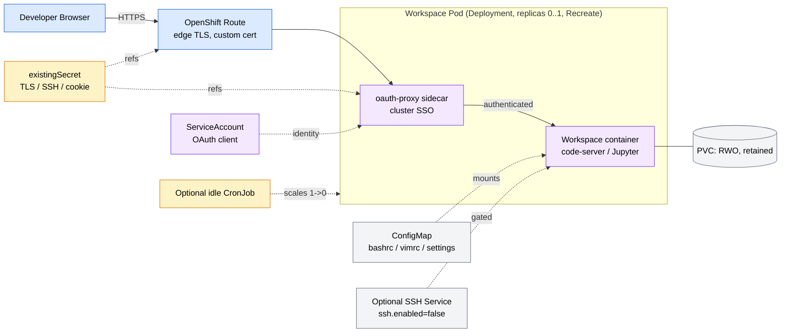

# dev-workspaces PRD

**Version**: 1.0
**Author**: Stephen Sequenzia
**Date**: 2026-06-06
**Status**: Draft
**Spec Type**: New product
**Spec Depth**: Detailed specifications
**Description**: A Helm chart (and a placeholder custom image) to deploy per-developer developer workspaces to an OpenShift cluster. The chart deploys a containerized workspace (code-server, Jupyter Lab, dev tooling) with persistent storage, OpenShift OAuth SSO, and a suspend/resume lifecycle. The Helm chart is the MVP focus; the container image is a placeholder for future work.

---

## 1. Executive Summary

`dev-workspaces` is an OpenShift-native Helm chart that provisions an isolated, browser-accessible development environment for each developer — code-server (VS Code in the browser) and Jupyter Lab today, OpenSSH later — backed by persistent storage and fronted by cluster single sign-on. One Helm release maps to one developer, so 10–50 workspaces run as independent, name-prefixed releases in a shared namespace. The chart prioritizes fast onboarding, reproducible environments, and durable per-developer state, while keeping idle cost under control through an explicit suspend/resume model.

## 2. Problem Statement

### 2.1 The Problem
Developers spend significant time provisioning and maintaining local development environments, and those environments drift apart over time ("works on my machine"). Teams targeting OpenShift have no turnkey, self-consistent way to give each developer a ready-to-use, browser-accessible environment that mirrors production tooling and survives restarts.

### 2.2 Current State
Environment setup is manual and per-machine: developers install language runtimes, editors, and tooling locally, with no enforced consistency. There is no chart in this repository yet — this is a new product built from scratch.

### 2.3 Impact Analysis
- **Onboarding latency**: new developers lose hours-to-days configuring environments before first commit.
- **Environment drift**: inconsistent toolchain versions cause "works on my machine" defects and irreproducible bugs.
- **Lost work risk**: ad-hoc local environments are not centrally backed or persisted.

### 2.4 Business Value
Centralizing developer environments on OpenShift compresses onboarding to minutes, guarantees a reproducible toolchain across the org, and gives platform owners a single, governable place to manage developer compute and storage.

## 3. Goals & Success Metrics

### 3.1 Primary Goals
1. **Fast onboarding** — a developer reaches a working, authenticated workspace in minutes.
2. **Reproducible environments** — every workspace runs the same tooling and versions from a single image and chart.
3. **Durable state** — code, configuration, and installed packages survive pod restarts and redeploys.

### 3.2 Success Metrics

| Metric | Current Baseline | Target | Measurement Method | Timeline |
|--------|------------------|--------|--------------------|----------|
| Time to first working workspace | Hours–days (manual local setup) | < 15 min from `helm install` to authenticated editor | Manual timing on a dev cluster | MVP |
| Environment reproducibility | Ad-hoc per machine | 100% of workspaces from one pinned image + chart | Image tag / chart version audit | MVP |
| State survival across restart/redeploy | No guarantee | 100% of `$HOME` workspace data persists | Restart pod, verify files/packages present | MVP |
| Idle cost reduction | All envs always-on | Idle workspaces scale to 0 replicas | Verify suspended workspace has 0 running pods | Phase 3 |

### 3.3 Non-Goals
- Building or finalizing the container **image** (placeholder for future work).
- Automatic **auto-wake-on-access** resume of suspended workspaces.
- A **GitOps automation** layer (chart is GitOps-ready, but automation ships later).
- Cluster-wide **ResourceQuota/LimitRange** governance (pod-level requests/limits only in MVP).
- Portability to vanilla Kubernetes (chart is intentionally OpenShift-native).

## 4. User Research

### 4.1 Target Users

#### Primary Persona: Internal Developer ("Dev")
- **Role/Description**: An engineer in a 10–50 person org who needs a consistent, ready-to-use dev environment on OpenShift.
- **Goals**: Start coding quickly; have the same tools as teammates; not lose work when a pod restarts.
- **Pain Points**: Slow local setup, version drift, fragile machine-specific configuration.
- **Context**: Daily development through a browser (code-server / Jupyter), authenticated with their existing cluster identity.

#### Secondary Persona: Platform / Cluster Admin ("Ops")
- **Role/Description**: Owns the OpenShift cluster; provisions and governs workspaces.
- **Goals**: Provision workspaces reproducibly (`helm install`), control compute/storage cost, enforce least-privilege security.
- **Pain Points**: Per-developer instances multiplying compute cost; granting elevated SCCs safely; keeping secrets out of git.

### 4.2 User Journey Map

```
[No environment] --> [Ops: helm install (user=alice)] --> [Dev: open Route URL]
   --> [OpenShift OAuth login] --> [code-server / Jupyter ready] --> [Work persists on PVC]
   --> [Idle: suspend to 0 replicas] --> [Dev: resume] --> [Work intact]
```

A developer is provisioned a named release, authenticates via cluster SSO at the Route, and works in a persistent environment. When idle, the workspace is suspended to zero replicas to save cost; resuming restores the same persistent state.

## 5. Functional Requirements

> The chart name is `dev-workspaces`. Each developer is provisioned as a separate Helm release in a **shared namespace** with name-prefixed resources (e.g. `dev-workspace-alice`). Resources below are templated per release.

### 5.1 Feature: Per-Developer Workspace Deployment

**Priority**: P0 (Critical)

#### User Stories
**US-001**: As Ops, I want one Helm release to deploy one developer's workspace so that each developer is isolated and independently managed.

**Acceptance Criteria**:
- [ ] `helm install <release> dev-workspaces --set user=<name>` creates a single-replica `Deployment` with name-prefixed resources.
- [ ] The `Deployment` uses `strategy.type: Recreate` (not `RollingUpdate`).
- [ ] The pod references a configurable `image.repository` and `image.tag` (placeholder image permitted).
- [ ] Two releases with different `user` values coexist in the same namespace without collision.

**Edge Cases**:
- Duplicate release name → `helm install` fails fast; no partial resources created.
- Image pull failure (placeholder not yet built) → pod reports `ImagePullBackOff`; documented as expected until the image exists.

---

### 5.2 Feature: Persistent Storage with Retention

**Priority**: P0 (Critical)

#### User Stories
**US-002**: As a Developer, I want my workspace files and installed packages to persist across restarts and redeploys so that I never lose work.

**Acceptance Criteria**:
- [ ] A `PersistentVolumeClaim` with `accessModes: [ReadWriteOnce]` is created per release.
- [ ] `storageClassName` and `storage` size are configurable via `values.yaml`.
- [ ] The PVC is annotated `helm.sh/resource-policy: keep` so it survives `helm uninstall`.
- [ ] After a pod restart and after `helm upgrade`, previously written `$HOME` data is still present.

**Edge Cases**:
- Reinstall after uninstall with the same `user` → existing retained PVC is reused (data intact) rather than re-created.
- No default `StorageClass` on the cluster and none set → install documented to require an explicit `storageClassName`.

---

### 5.3 Feature: Service, Route, and Edge TLS

**Priority**: P0 (Critical)

#### User Stories
**US-003**: As a Developer, I want a secure HTTPS URL to reach my workspace so that I can work from a browser.

**Acceptance Criteria**:
- [ ] A `ClusterIP` `Service` exposes the workspace web port(s) (code-server, Jupyter).
- [ ] An OpenShift `Route` exposes the Service with **edge** TLS termination.
- [ ] The Route uses a **custom certificate/key referenced from a Secret** (not inline values).
- [ ] The Route hostname is configurable via `values.yaml`.

**Edge Cases**:
- Missing TLS Secret → install fails with a clear error referencing the expected Secret name.
- Hostname not covered by the custom cert SAN → documented as an Ops prerequisite (see Open Questions).

---

### 5.4 Feature: OpenShift OAuth SSO (oauth-proxy sidecar)

**Priority**: P0 (Critical) — *Agent-recommended, accepted*

#### User Stories
**US-004**: As Ops, I want workspace access gated by the cluster's identity so that only authorized cluster users reach a workspace, without adding app-level auth.

**Acceptance Criteria**:
- [ ] An `oauth-proxy` sidecar container runs in the workspace pod and sits in front of code-server/Jupyter.
- [ ] A `ServiceAccount` is created and annotated as an OAuth client (redirect reference to the Route).
- [ ] Unauthenticated requests to the Route are redirected to the OpenShift login and only reach the workspace after successful auth.
- [ ] The oauth-proxy cookie/session secret is sourced from a referenced Secret (see 5.6).

**Edge Cases**:
- Expired session → user is re-challenged at the Route; workspace is never exposed unauthenticated.
- WebSocket traffic (code-server) passes through the proxy without upgrade failures.

---

### 5.5 Feature: ConfigMap-Managed Workspace Configuration

**Priority**: P1 (High)

#### User Stories
**US-005**: As a Developer, I want consistent shell/editor configuration (e.g. `bashrc`, `vimrc`, code-server settings) so that every workspace behaves the same.

**Acceptance Criteria**:
- [ ] A `ConfigMap` holds workspace configuration files and is mounted into the pod.
- [ ] Config content is overridable via `values.yaml`.
- [ ] Changing the ConfigMap and running `helm upgrade` updates configuration on next pod start.

**Edge Cases**:
- Empty/default config → workspace still starts with image defaults.

---

### 5.6 Feature: Secret Management via `existingSecret`

**Priority**: P0 (Critical) — *Agent-recommended, accepted*

#### User Stories
**US-006**: As Ops, I want all sensitive material referenced from pre-created Secrets so that secrets never live in chart values or git (GitOps-safe).

**Acceptance Criteria**:
- [ ] The chart references **`existingSecret`** name(s) for: TLS cert/key, oauth-proxy cookie secret, and SSH keys.
- [ ] The chart does **not** template raw secret values from `values.yaml` for these fields.
- [ ] Missing a required referenced Secret produces a clear install-time error.

**Edge Cases**:
- Non-GitOps quick start → documentation explains how to pre-create the Secret(s) with `oc create secret`.

---

### 5.7 Feature: Suspend / Resume Lifecycle (replaces HPA)

**Priority**: P1 (High) — *Agent-recommended, accepted; replaces the original HorizontalPodAutoscaler*

#### User Stories
**US-007**: As Ops, I want to suspend an idle workspace to zero replicas and resume it later so that idle workspaces cost nothing while preserving state.

**Acceptance Criteria**:
- [ ] A per-workspace `suspended` value toggles the `Deployment` replicas between `1` (running) and `0` (suspended).
- [ ] `suspended: true` results in zero running pods; the retained PVC is untouched.
- [ ] Setting `suspended: false` (resume) restores a running pod with all prior PVC data intact.
- [ ] Because of `strategy.type: Recreate`, resume does not hit a Multi-Attach error on the RWO volume.

**Edge Cases**:
- Rapid suspend→resume toggling → resume waits for volume detach; documented brief settle time.
- Resume in a topology-constrained cluster → pod must reschedule where the RWO volume can attach (see Risks).
- In-memory editor session is lost on suspend (expected); persistent files survive — documented so users save work.

---

### 5.8 Feature: Optional Idle CronJob

**Priority**: P2 (Medium) — *Agent-recommended, accepted*

#### User Stories
**US-008**: As Ops, I want idle workspaces automatically suspended so that I don't manually manage cost across many instances.

**Acceptance Criteria**:
- [ ] An optional `CronJob` (gated, e.g. `idleReaper.enabled=false` by default) scales idle workspaces to `0`.
- [ ] The idle signal is owned by the chart (e.g. last-access / low-CPU heuristic), not an in-request proxy.
- [ ] Resume remains an explicit action (no auto-wake-on-access in MVP).

**Edge Cases**:
- A developer actively working is not suspended (idle heuristic respects recent activity).

---

### 5.9 Feature: Fixed-UID Security Context + Optional SCC

**Priority**: P1 (High) — *Agent-recommended, accepted*

#### User Stories
**US-009**: As Ops, I want the workspace to run as a fixed UID with the SCC handling made explicit so that the deployment is reproducible and won't silently fail admission.

**Acceptance Criteria**:
- [ ] The pod sets a configurable fixed `runAsUser` in its `securityContext`.
- [ ] The chart includes an **optional, gated** `SecurityContextConstraints` + `RoleBinding` (e.g. `scc.create=false` by default, since applying it requires cluster-admin).
- [ ] Documentation states the prerequisite (`anyuid`/custom SCC grant) needed for the fixed UID to be admitted.

**Edge Cases**:
- Fixed UID without an SCC grant → pod rejected by `restricted-v2`; documented troubleshooting note.

---

### 5.10 Feature: Optional SSH Access

**Priority**: P2 (Medium)

#### User Stories
**US-010**: As a Developer, I want optional SSH access to my workspace so that I can use remote tooling — available once the image ships SSH.

**Acceptance Criteria**:
- [ ] SSH `Service` and SSH-key Secret references are templated but gated behind `ssh.enabled=false` by default.
- [ ] When disabled, no SSH Service/Route/ports are created.
- [ ] When enabled, SSH public keys are sourced from a referenced Secret (see 5.6).

**Edge Cases**:
- SSH enabled before the image provides an SSH server → documented as dependent on image work (out of scope for MVP).

---

### 5.11 Feature: Configurable Resource Envelope & Values Contract

**Priority**: P1 (High)

#### User Stories
**US-011**: As Ops, I want CPU/memory/storage and key behaviors configurable through a clear `values.yaml` so that I can tune workspaces and adopt GitOps later.

**Acceptance Criteria**:
- [ ] Pod CPU/memory `requests` and `limits` are configurable; a modest default is set and documented.
- [ ] PVC size and `storageClassName` are configurable.
- [ ] `values.yaml` is structured so a per-developer values file can be committed for GitOps adoption without rework.
- [ ] A `values.schema.json` validates required fields and fails fast on `helm install` (lightweight, even though MVP validation is otherwise manual).

**Edge Cases**:
- Invalid/missing required values → `helm install` fails against the schema with a clear message.

## 6. Non-Functional Requirements

### 6.1 Performance
- Per-workspace resource envelope (CPU/memory/storage) is configurable; no fixed default mandated, but a modest default is provided.
- Suspend reduces a workspace to **0 running pods** (no idle compute cost); only the retained PVC persists.

### 6.2 Security
- **Authentication**: OpenShift OAuth (cluster SSO) enforced at the Route via an `oauth-proxy` sidecar; workspaces are never exposed unauthenticated.
- **Transport**: Route uses edge TLS with a custom certificate referenced from a Secret.
- **Secrets**: all sensitive material (TLS, SSH keys, oauth cookie secret) is referenced via `existingSecret` and never stored in chart values/git.
- **Workload identity**: fixed `runAsUser`, with an explicit (optional, gated) SCC + RoleBinding and documented `anyuid`/custom-SCC prerequisite.

### 6.3 Scalability
- Target: **10–50 concurrent per-developer workspaces**, each an independent Helm release in a shared, name-prefixed namespace.
- Scaling is **vertical/lifecycle** (per-workspace sizing + suspend/resume), not horizontal — a single-user RWO-backed workspace cannot be horizontally replicated.

### 6.4 Accessibility
- Not a primary driver for an internal infrastructure chart. Accessibility of the editors (code-server, Jupyter) is inherited from those upstream tools, not implemented here.

## 7. Technical Considerations

### 7.1 Architecture Overview



A single Helm release per developer renders a `Deployment` (one workspace container + `oauth-proxy` sidecar), a `ClusterIP` Service, an OpenShift `Route` (edge TLS), a retained RWO `PVC`, a `ConfigMap`, and references to pre-created Secrets. Suspend/resume drives replicas between 0 and 1.

### 7.1.1 Workspace Lifecycle

```mermaid
stateDiagram-v2
    [*] --> Provisioned : helm install (user=alice)
    Provisioned --> Running : replicas=1
    Running --> Suspended : suspended=true (replicas 0)
    Suspended --> Running : suspended=false (resume; PVC intact)
    Running --> Uninstalled : helm uninstall
    Suspended --> Uninstalled : helm uninstall
    Uninstalled --> [*] : PVC retained (data survives)
```



### 7.2 Tech Stack / Components
- **Packaging**: Helm chart named `dev-workspaces` (templated per-developer release).
- **Platform**: OpenShift 4.x — `Route`, OAuth (`oauth-proxy`), `SecurityContextConstraints`.
- **Workspace runtime (placeholder image)**: code-server, Jupyter Lab, dev tooling (Python 3.12+/UV, Node 18+, Git), OpenSSH (later).
- **Kubernetes resources**: `Deployment`, `Service`, `Route`, `PersistentVolumeClaim`, `ConfigMap`, Secret references, `ServiceAccount`, optional `CronJob`, optional `SecurityContextConstraints` + `RoleBinding`.
- **Storage**: `ReadWriteOnce` PVC, configurable `StorageClass`, retained on uninstall.

### 7.3 Integration Points
| System | Integration Type | Purpose |
|--------|------------------|---------|
| OpenShift OAuth server | OAuth client (ServiceAccount) | Cluster SSO at the Route via oauth-proxy |
| OpenShift Router (HAProxy) | `Route` (edge TLS) | Public HTTPS ingress to the workspace |
| Cluster StorageClass / CSI | `PersistentVolumeClaim` (RWO) | Durable per-developer `$HOME` storage |
| Cluster SCC admission | `SecurityContextConstraints` + `RoleBinding` | Admit the fixed-UID workspace pod |
| Container registry | `image.repository`/`tag` | Source of the workspace image (placeholder) |

### 7.4 Technical Constraints
- **OpenShift-native by design** — uses `Route`, OAuth, and SCC; not portable to vanilla Kubernetes.
- **`strategy.type: Recreate` is mandatory** — a `RollingUpdate` would deadlock on the RWO volume (Multi-Attach).
- **Single replica per workspace** — RWO volume + single user precludes horizontal scaling (the original HPA is intentionally removed).
- **Fixed UID requires elevated SCC** — needs cluster-admin to grant `anyuid`/custom SCC.
- **Auto-wake-on-access is not feasible in MVP** — the KEDA HTTP add-on interceptor returns HTTP 403 on WebSocket upgrades (code-server depends on WebSockets), and is beta/unsupported; Knative assumes stateless workloads.

## 8. Scope Definition

### 8.1 In Scope
- Helm chart `dev-workspaces` deploying a per-developer workspace: `Deployment` (+ oauth-proxy sidecar), `Service`, `Route` (edge TLS, custom cert), retained RWO `PVC`, `ConfigMap`, Secret references, `ServiceAccount`.
- Suspend/resume lifecycle via a `suspended` value (replaces HPA); optional gated idle `CronJob`.
- Fixed-UID security context with optional gated SCC + RoleBinding and documented prerequisite.
- Optional, gated SSH `Service`/Secret references (`ssh.enabled=false` by default).
- Configurable resource/storage envelope; GitOps-ready `values.yaml` + `values.schema.json`.
- Manual validation on a dev cluster.

### 8.2 Out of Scope
- **Container image build** — placeholder only; the actual image (code-server, Jupyter, runtimes, SSH server, dotfiles) ships later.
- **Auto-wake-on-access** resume; **KEDA/Knative** auto-scaling.
- **GitOps automation** (ArgoCD/Flux pipelines) — the chart is GitOps-ready, automation is later.
- **ResourceQuota / LimitRange** namespace governance — pod-level requests/limits only.
- **Automated CI / `helm test`** smoke hooks — manual validation for MVP.

### 8.3 Future Considerations
- Build and pin the workspace container image; wire `ssh.enabled=true` once the image ships an SSH server.
- Automatic auto-wake-on-access once KEDA's HTTP add-on supports WebSockets (track [kedacore/http-add-on#654](https://github.com/kedacore/http-add-on/issues/654)) or evaluate a commercial HTTP scaler.
- KEDA core (Custom Metrics Autoscaler) with a custom activity trigger for smarter idling.
- GitOps adoption: per-developer values files reconciled by ArgoCD/Flux; one-namespace-per-developer isolation.
- `ResourceQuota`/`LimitRange` and CI (`helm lint`/`template`/schema + `helm test`).

## 9. Implementation Plan

### 9.1 Phase 1: Foundation
**Completion Criteria**: A single workspace pod runs from the chart with persistent storage and basic configuration.

| Deliverable | Description | Dependencies |
|-------------|-------------|--------------|
| Chart skeleton + `values.yaml` + `values.schema.json` | `dev-workspaces` chart structure, configurable values, schema validation | — |
| `Deployment` (`Recreate`, single replica) | Workspace container referencing placeholder image | Chart skeleton |
| `PersistentVolumeClaim` (RWO, retained) | Durable `$HOME`, `helm.sh/resource-policy: keep` | Deployment |
| `Service` (ClusterIP) | Exposes workspace web ports | Deployment |
| `ConfigMap` | bashrc/vimrc/code-server settings, mounted | Deployment |
| Secret references (`existingSecret`) | Wiring for TLS/SSH/cookie secrets | — |

**Checkpoint Gate**: Architecture review of the chart structure and the per-developer release model before access/security work begins.

---

### 9.2 Phase 2: Access
**Completion Criteria**: A developer reaches their workspace over HTTPS, authenticated by cluster SSO.

| Deliverable | Description | Dependencies |
|-------------|-------------|--------------|
| `Route` (edge TLS, custom cert) | HTTPS ingress using cert from referenced Secret | Phase 1 Service |
| `oauth-proxy` sidecar + `ServiceAccount` | Cluster SSO in front of code-server/Jupyter | Route |
| End-to-end auth flow | Unauthenticated → OpenShift login → workspace | oauth-proxy |

**Checkpoint Gate**: Security review of the OAuth/oauth-proxy configuration and TLS handling before lifecycle work.

---

### 9.3 Phase 3: Lifecycle
**Completion Criteria**: A workspace can be suspended to zero replicas and resumed with state intact; cost goal met.

| Deliverable | Description | Dependencies |
|-------------|-------------|--------------|
| `suspended` value toggle | Replicas 1↔0 per workspace | Phase 1 Deployment |
| `Recreate` strategy verification | Confirm no Multi-Attach on resume | suspended toggle |
| PVC retention verification | Data survives suspend/resume and uninstall | Phase 1 PVC |
| Optional idle `CronJob` (gated) | Auto-suspend idle workspaces; explicit resume | suspended toggle |

**Checkpoint Gate**: Review suspend/resume behavior on a representative cluster (volume reattach, scheduling) before hardening.

---

### 9.4 Phase 4: Hardening
**Completion Criteria**: The chart runs under the intended security posture, with optional SSH and documentation, validated manually.

| Deliverable | Description | Dependencies |
|-------------|-------------|--------------|
| Fixed-UID `securityContext` + optional SCC/RoleBinding (gated) | Admit fixed-UID pod; document prerequisite | Phase 1–3 |
| Pod requests/limits defaults | Configurable resource envelope | Deployment |
| Optional SSH Service/Secret (gated) | `ssh.enabled=false` default; ready for image work | Secret references |
| Docs + manual validation | Install/operate guide; verify on a dev cluster | All phases |

**Checkpoint Gate**: Final manual validation sign-off on a dev cluster before declaring MVP complete.

## 10. Dependencies

### 10.1 Technical Dependencies
| Dependency | Owner | Status | Risk if Delayed |
|------------|-------|--------|-----------------|
| OpenShift 4.x cluster (Route, OAuth, SCC) | Ops | Available | Blocks all deployment |
| RWO StorageClass / CSI provisioner | Ops | Assumed available | No persistence |
| Cluster-admin to grant `anyuid`/custom SCC | Ops | Pending | Fixed-UID pod won't start |
| Pre-created Secrets (TLS, SSH, cookie) | Ops | Pending | Install fails on missing Secret |
| Workspace container image | Image work (later) | Placeholder | Pod `ImagePullBackOff` until built |

### 10.2 Cross-Team Dependencies
| Team | Dependency | Status |
|------|------------|--------|
| Platform/Ops | SCC grant, StorageClass, OAuth client registration, DNS/cert for Route hostname | Pending |

## 11. Risks & Mitigations

| Risk | Impact | Likelihood | Mitigation Strategy | Owner |
|------|--------|------------|---------------------|-------|
| RWO volume Multi-Attach deadlock on resume/redeploy | High | Med | Enforce `strategy.type: Recreate`; settle/poll on resume | Eng |
| Volume node-affinity conflict on resume (zonal storage) | Med | Med | Ensure StorageClass/topology allows rescheduling, or accept same-zone resume | Eng/Ops |
| Fixed-UID pod rejected by `restricted-v2` SCC | High | Med | Ship optional SCC+RoleBinding; document `anyuid` prerequisite | Ops |
| Secrets accidentally committed via GitOps values | High | Low | `existingSecret` references only; no secret values in chart | Eng |
| oauth-proxy breaks code-server WebSockets | High | Low | Validate WS upgrade through proxy; oauth-proxy is WS-compatible (unlike KEDA HTTP add-on) | Eng |
| Custom cert hostname/SAN mismatch | Med | Med | Document hostname/cert prerequisite; validate before rollout | Ops |
| Idle CronJob suspends an active workspace | Med | Low | Activity-aware idle heuristic; gated off by default | Eng |

## 12. Open Questions

| # | Question | Owner | Due Date | Resolution |
|---|----------|-------|----------|------------|
| 1 | Placeholder image registry + pull-secret strategy | Image work | Phase 1 | TBD (deferred with image work) |
| 2 | Per-developer Route hostnames: wildcard cert vs individually managed certs (affects custom-cert SAN coverage) | Ops | Phase 2 | TBD |
| 3 | Idle heuristic signal source (last route access vs CPU vs code-server heartbeat) | Eng | Phase 3 | TBD |
| 4 | Default `runAsUser` value and whether image filesystem ownership matches it | Eng/Image | Phase 4 | TBD |

## 13. Appendix

### 13.1 Glossary
| Term | Definition |
|------|------------|
| code-server | VS Code running in the browser, served from the workspace pod |
| Route | OpenShift resource exposing a Service externally via the HAProxy router |
| SCC | SecurityContextConstraints — OpenShift admission policy governing pod security |
| oauth-proxy | Sidecar that enforces OpenShift OAuth in front of an arbitrary web app |
| RWO | ReadWriteOnce — a volume mountable by a single node/pod at a time |
| `existingSecret` | A pre-created Kubernetes Secret referenced (not templated) by the chart |
| Suspend/Resume | Scaling a workspace `Deployment` between 0 and 1 replicas to control idle cost |

### 13.2 References
- Idling applications — OpenShift Container Platform (Red Hat docs)
- Custom Metrics Autoscaler (KEDA) on OpenShift — Red Hat docs
- KEDA HTTP Add-on — WebSocket upgrade limitation: https://github.com/kedacore/http-add-on/issues/654
- OpenShift Serverless (Knative) — stateless workload model (Red Hat docs)
- Kubernetes — RollingUpdate with RWO volume / Multi-Attach: https://github.com/kubernetes/kubernetes/issues/115997

---

*Document generated by SDD Tools*
